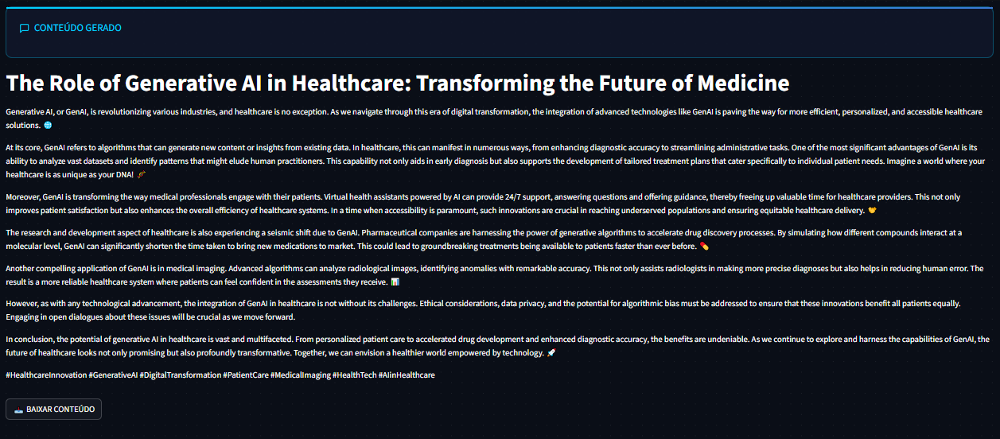

# SEO Content Generator with LangChain, LLM and OpenAI


## 🔍 Project Description
A streamlined content generation tool powered by OpenAI's GPT-4, designed to create SEO-optimized marketing content in multiple languages. The system automatically matches the output language to the input prompt.

## ✨ Core Features
- **Intelligent Content Generation**: Uses OpenAI's GPT-4 to produce high-quality, tailored content
- **Language Matching**: Responds in the same language as the input prompt (Portuguese, English, etc.)
- **SEO Optimization**: Incorporates provided keywords naturally into the content
- **Customizable Output**: Control tone, length, and style for different platforms
- **CTA Integration**: Seamlessly includes calls-to-action when specified

## 🛠️ Technical Implementation
- Built with Python using LangChain's OpenAI integration
- Streamlit-based web interface
- Environment variables for API key management
- Modular architecture separating:
  - Core generation logic (OpenAI)
  - Frontend components
  - Main application flow

## 🚀 How to Use This Project

1. First, clone the repository:
```bash
git clone https://github.com/Brunotorres15/seo-content-generator-langchain-llm-openai

cd seo-content-generator-langchain-llm-openai
```
2. Install the required dependencies:
```bash
pip install -r requirements.txt
```
3. Create a .env file with your OpenAI API key:
```bash
OPENAI_API_KEY=your_api_key_here
```

4. Run the Streamlit application:
```bash
streamlit run app.py
```

5. In your browser:
```bash
- Fill in the content parameters
- Click "Generate Content"
- Copy or download the Markdown output
```

## 📂 Code Structure

```
├── llm.py # Content generation with OpenAI
├── frontend.py # Streamlit UI components
├── app.py # Main application logic
├── requirements.txt # necessary libs for the project
└── .env # Configuration (OPENAI_API_KEY)
```

## 🤖 How It Works
1. Receives user parameters (topic, keywords, tone, etc.)
2. Constructs optimized prompt for OpenAI
3. Generates content matching the input language
4. Returns formatted Markdown output with:
   - Proper headings
   - Paragraph structure
   - Optional CTAs/hashtags/emojis



## How to use it 

## 🌟 Key Differentiators
- Focus on natural language matching (no forced translations)
- Clean Markdown output ready for publishing
- Simple, intuitive interface
- No unnecessary dependencies or complexity

Built with ❤️ using OpenAI's powerful language models